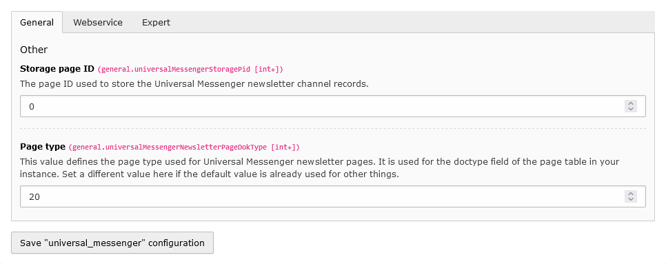
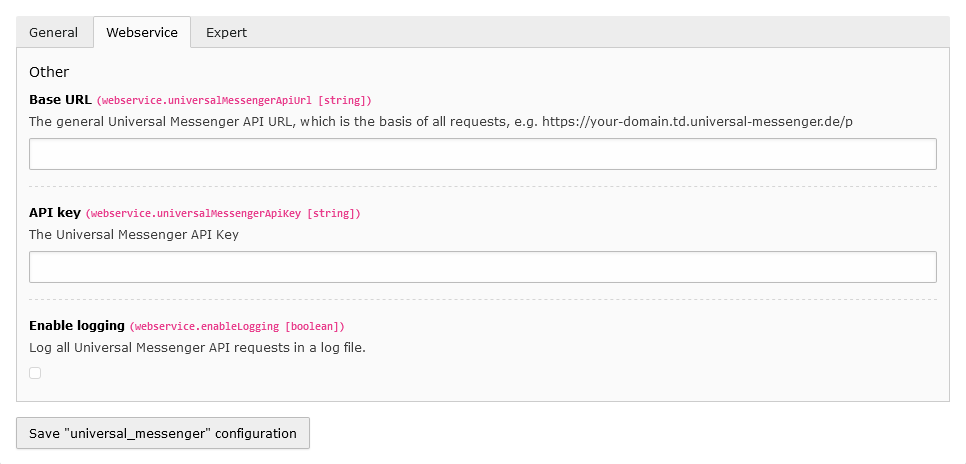

[](https://github.com/netresearch/universal-messenger/releases/latest)
[](https://github.com/netresearch/universal-messenger/blob/main/LICENSE)
[](https://github.com/netresearch/universal-messenger/actions/workflows/ci.yml)

# universal-messenger
Extension providing a TYPO3 backend module to send TYPO3 pages as newsletters via Universal Messenger API. 


## Installation

The extension should be installed via composer:

``composer require netresearch/universal-messenger``


## Setup
### Extension configuration

| Field           | Tab        | Default value | Description                                                                                                                                                                                                                             |
|:----------------|:-----------|:--------------|:----------------------------------------------------------------------------------------------------------------------------------------------------------------------------------------------------------------------------------------|
| Storage page ID | General    | 0             | The page ID used to store the Universal Messenger newsletter channel records.                                                                                                                                                           |
| Page type       | General    | 20            | This value defines the page type used for Universal Messenger newsletter pages. It is used for the doctype field of the page table in your instance. Set a different value here if the default value is already used for other things.  |
| Base URL        | Webservice |               | The general Universal Messenger API URL, which is the basis of all requests, e.g. https://your-domain.td.universal-messenger.de/p                                                                                                       |
| API key         | Webservice |               | The Universal Messenger API Key                                                                                                                                                                                                         |
| Enable logging  | Webservice | 0             | Log all Universal Messenger API requests in a log file.                                                                                                                                                                                 |

 
*Fig. 1: Extension Configuration Tab "General"*



*Fig. 2: Extension Configuration Tab "Webservice"*


To enable the request/response logging of the Universal Messenger, enable the extension configuration "Enable logging"
and add a logger to your `ext_localconf.php`:

```php
// Add logger for universal messenger
$GLOBALS['TYPO3_CONF_VARS']['LOG']['Netresearch']['UniversalMessenger']['writerConfiguration'] = [
    \Psr\Log\LogLevel::DEBUG => [
        \TYPO3\CMS\Core\Log\Writer\FileWriter::class => [
            'logFileInfix' => 'universal_messenger',
        ],
    ],
];
```


### TypoScript
By setting the "inlineCssFiles" setting, additional CSS can be passed to the newsletter container. This can, 
for example, be the CSS of an email framework such as https://github.com/foundation/foundation-emails:

```typo3_typoscript
plugin.tx_universalmessenger {
    settings {
        inlineCssFiles {
            10 = EXT:<YOUR-EXTENTSION>/Resources/Private/Css/<YOUR-CSS-FILE>.css
        }
    }
}

module.tx_universalmessenger < plugin.tx_universalmessenger
```

To enable test operation, a separate channel can be set up as a test channel for a newsletter in
Universal Messenger and, for example, given a suffix.

Test operation
- Channel: Newsletter_TEST
- Recipient: Defined recipient list for validating the newsletter before it is actually sent to customers.

Live operation
- Channel: Newsletter_LIVE
- Recipient: Recipient list with customer addresses

Using the setting "newsletter" => "testChannelSuffix" and "liveChannelSuffix", this suffix can be 
adapted to the setting in Universal Messenger:

```typo3_typoscript
plugin.tx_universalmessenger {
    settings {
        newsletter {
            testChannelSuffix = _Test
            liveChannelSuffix = _Live
        }
    }
}
```


### Scheduler-Task
The extension provides a console command `universal-messenger:newsletter-channels:import` for importing the
Universal Messenger newsletter channels. This command can be configured as a scheduler task to automatically load the
newsletter channels into TYPO3 once a day, for example.


## Usage
The newsletter channels are imported into TYPO3 as generic channels, i.e. the configured suffixes for the
test or live channels are removed (the spelling is irrelevant, i.e. an upper and lower case is ignored).

Each newsletter channel can also be configured with additional settings (a new import does not overwrite these settings):

| Field                  | Default value | Description                                                                                                      |
|:-----------------------|:--------------|:-----------------------------------------------------------------------------------------------------------------|
| Sender email address   |               | The sender's email address. If set, this overwrites the sender ID preset in the configuration file.              |
| Reply-to email address |               | The reply-to email address. If set, this overwrites the reply-to ID preset in the configuration file.            |
| Skip used ID           | 0             | Enable if the sending should be canceled if there is already a newsletter with the same event ID in the archive. |
| Embed images           | none          | Behavior for embedding images.                                                                                   |

These settings are sent to the Universal Messenger API when the newsletter page is submitted.


## Testing
```bash
composer install

composer ci:cgl
composer ci:test
composer ci:test:php:phplint
composer ci:test:php:phpstan
composer ci:test:php:rector
```
